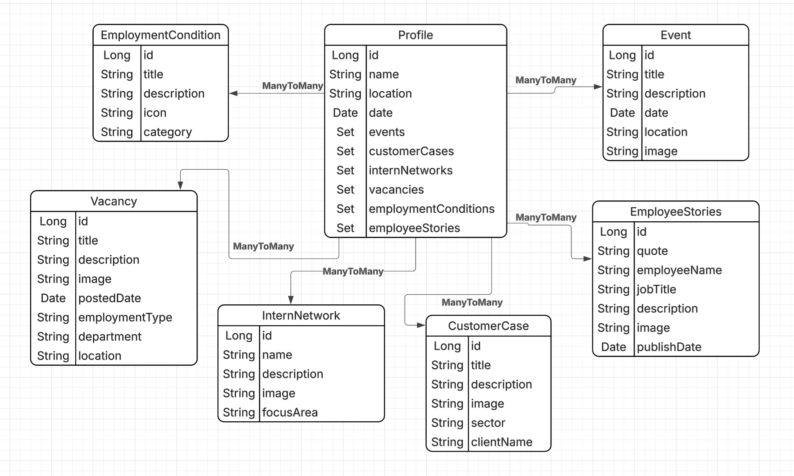

# Capgemini Flying Carpet

Capgemini flying carpet is een stageopdracht met betrekking tot het bouwen van een applicatie die gebruikt wordt op stagemarkten om zowel nieuwe medewerkers als potentiële klanten te werven.

## Clientside

Deze repository bestaat uit 2 verschillende front-ends: ```dashboard``` welke staat voor het dashboard waar je data in de database toevoegd, aanpast en verwijderd & ```client``` welke de daadwerkelijke beursmarktapplicatie is.

Beide zijn gemaakt met React Javascript, en gezien de verschillende requirements is de één met vanilla CSS gemaakt en de ander met Tailwindcss.

Beide zijn op de starten door in je terminal naar de desbetreffende folder te gaan, ``npm i`` te runnen (dit hoeft alleen de eerste keer, dit installeert de nodige dependencies) en vervolgens ``npm run dev`` te runnen.

## Server en database

ERD diagram van de back-end:


De serverside is gebouwd met Java 21 en het Spring framework. Ook is er een connectie tussen de server side met een PostgreSQL database. Deze database is geinteregreerd met het Spring framework via een interface. 

Er is gekozen voor een 4-lagen architectuur, bestaande uit:

- Presentation (Controllers)
- Application (Services)
- Domain (Domeinmodel)
- Data (Database)

De PostgreSQL database bestaat uit PostgreSQL 16. 